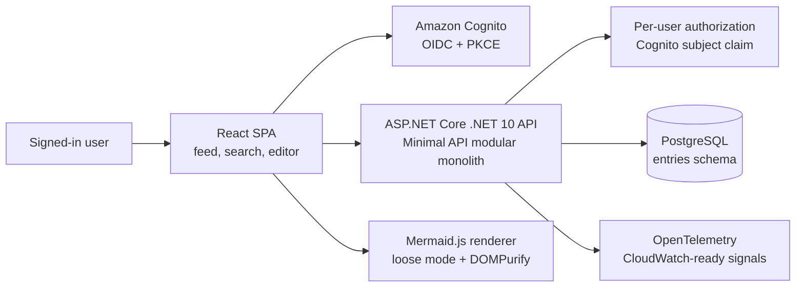
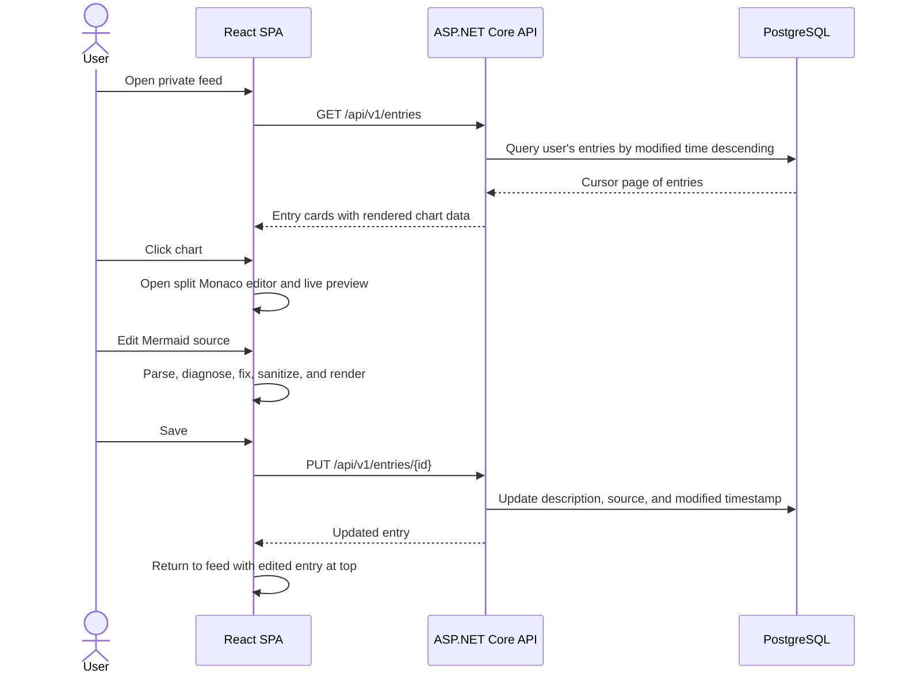
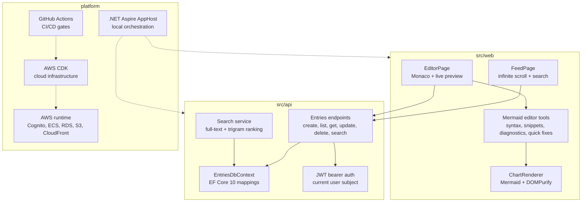
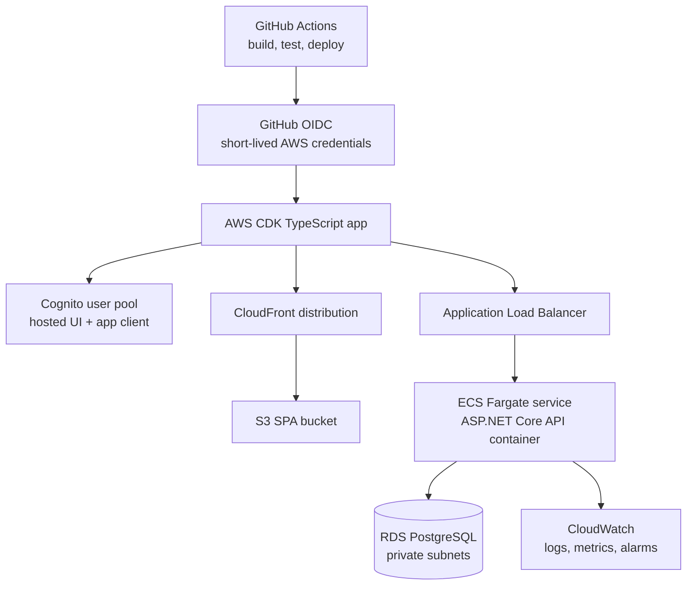

# Mermaid Notes .NET 10 Reference App

Mermaid Notes is a reference application for private diagram notes. Signed-in users create Markdown summaries with Mermaid chart definitions, browse a reverse-chronological feed, search descriptions and Mermaid source, and edit diagrams in a split Monaco/Mermaid live preview experience.

The repo demonstrates a modern .NET-on-AWS architecture:

- ASP.NET Core .NET 10 Minimal API modular monolith.
- React 19 + TypeScript + Vite SPA.
- Amazon Cognito OIDC with Authorization Code + PKCE.
- EF Core 10 with PostgreSQL, full-text search, and trigram indexes.
- .NET Aspire AppHost for local orchestration.
- AWS CDK in TypeScript for ECS Fargate, RDS, S3/CloudFront, Cognito, CloudWatch, and GitHub OIDC.
- GitHub Actions CI/CD with staging deployment and production approval gate.

## At A Glance

| Area | What It Shows | Primary Technology |
| --- | --- | --- |
| User experience | Reverse-chronological note feed, search, split Mermaid editor, live chart preview | React, Fluent UI, TanStack Query, Monaco Editor, Mermaid.js |
| API | Versioned entry endpoints with user-scoped ownership rules | ASP.NET Core .NET 10 Minimal APIs |
| Data | Markdown description, Mermaid source, timestamps, cursor paging, full-text search | EF Core 10, PostgreSQL, pg_trgm |
| Identity | Browser sign-in and API token validation | Amazon Cognito OIDC, Authorization Code + PKCE, JWT bearer auth |
| Local platform | One-command local orchestration with database and telemetry surface | .NET Aspire AppHost |
| Cloud platform | Production-shaped AWS deployment | ECS Fargate, RDS PostgreSQL, S3, CloudFront, ALB, CloudWatch |
| Delivery | Build, test, deploy, and production approval workflow | GitHub Actions, GitHub OIDC, AWS CDK |

## System Flow



## User Workflow



## Module Map



## Repository Layout

```text
src/api       ASP.NET Core .NET 10 API
src/web       React/TypeScript SPA
src/apphost   .NET Aspire local orchestration
tests/api     API unit and integration tests
infra/cdk     AWS CDK TypeScript app
docs          Architecture, ADRs, threat model, runbooks
```

## Prerequisites

Install these tools before running the full local or cloud workflow:

- .NET SDK 10.0.x
- Node.js 26.x
- Docker Desktop or OrbStack
- AWS CLI v2
- AWS CDK bootstrapped for the target account and region
- PostgreSQL only if you are not using Aspire/Docker

## Local Development

Run the local orchestrated environment after installing .NET 10 and Docker:

```bash
dotnet restore MermaidNotes.slnx
dotnet run --project src/apphost/MermaidNotes.AppHost.csproj
```

The AppHost starts PostgreSQL, the API, and the Vite app. By default, local development uses mock browser auth and API test auth to keep the feedback loop fast. To use real Cognito locally, provision the dev stack and set AppHost user secrets:

```bash
dotnet user-secrets set --project src/apphost Authentication:Mode Cognito
dotnet user-secrets set --project src/apphost Web:AuthMode oidc
```

Then configure `src/web/.env` from `src/web/.env.example`.

## Backend Commands

```bash
dotnet restore MermaidNotes.slnx
dotnet build MermaidNotes.slnx
dotnet test tests/api/MermaidNotes.Api.Tests.csproj
dotnet ef database update --project src/api
```

## Frontend Commands

```bash
cd src/web
npm ci
npm run dev
npm test
npm run build
```

## Infrastructure Commands

```bash
cd infra/cdk
npm ci
npm run build
npm test
npx cdk bootstrap
npx cdk deploy MermaidNotes-staging \
  --context stage=staging \
  --context githubOwner=<github-owner> \
  --context githubRepo=<repo-name>
```

After first deployment, copy CDK outputs into the `staging` and `production` GitHub Environment variables referenced by `.github/workflows/deploy.yml`.

## Deployment Shape



The deployment workflow defaults to staging on `main`. Production deployment is intentionally gated through a GitHub Environment approval and should only run after the AWS account, domain, secret rotation, and observability settings have been reviewed.

## Security Note

Mermaid is configured with `securityLevel: "loose"` because this project intentionally allows richer diagram features. The renderer still sanitizes SVG output with DOMPurify and the HTML document includes a restrictive CSP, but loose Mermaid rendering should be treated as a reviewed exception in a corporate environment. See [ADR 0004](docs/adr/0004-mermaid-loose-rendering.md) and [Threat Model](docs/threat-model.md).
