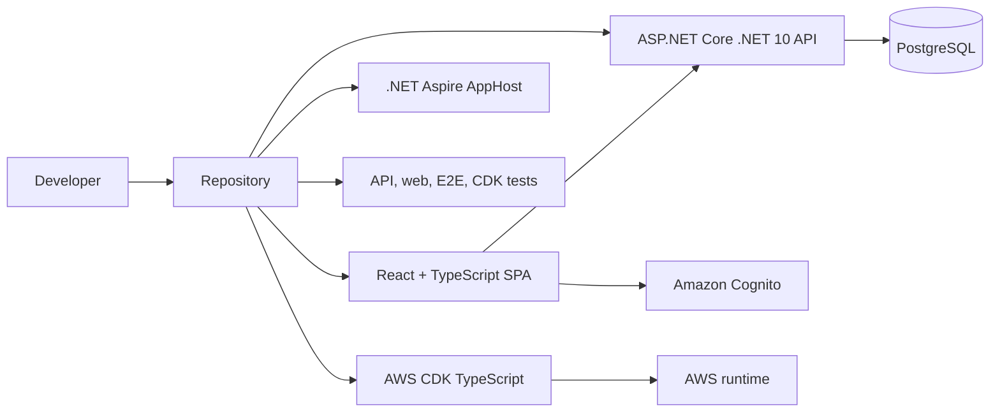
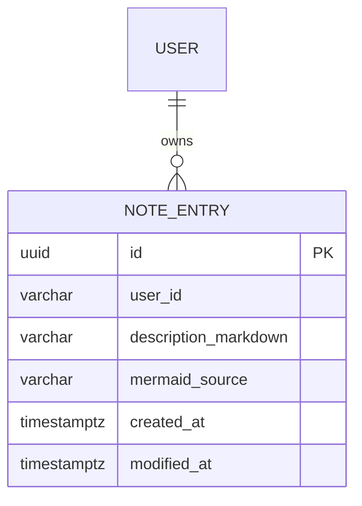
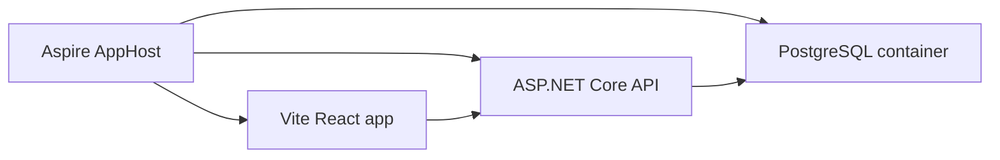
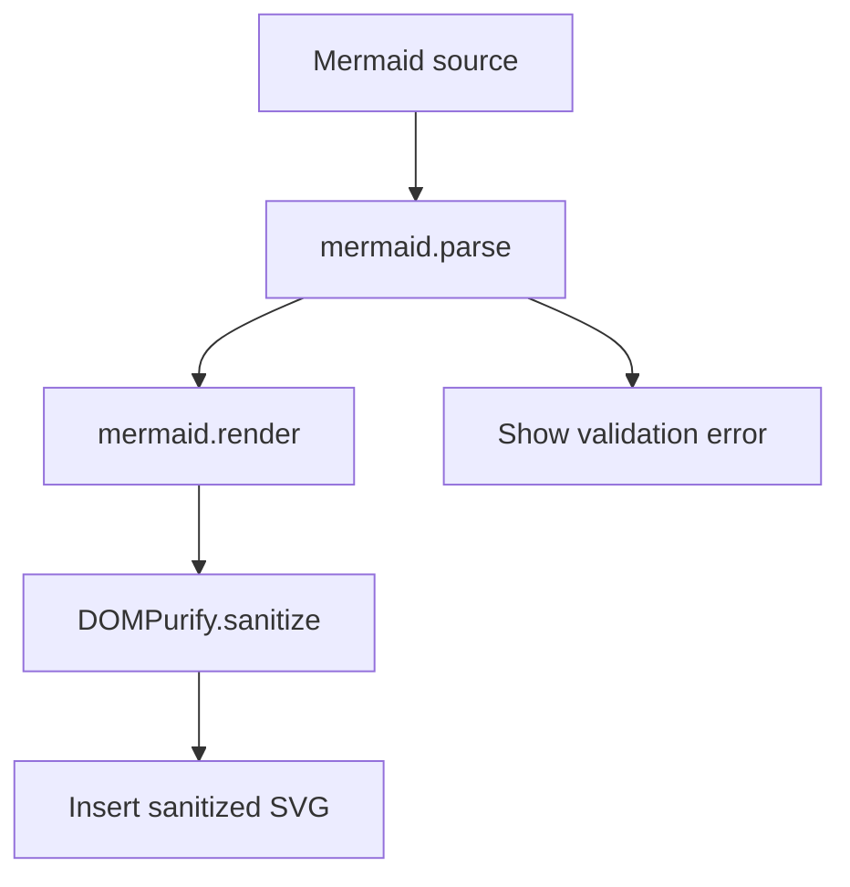
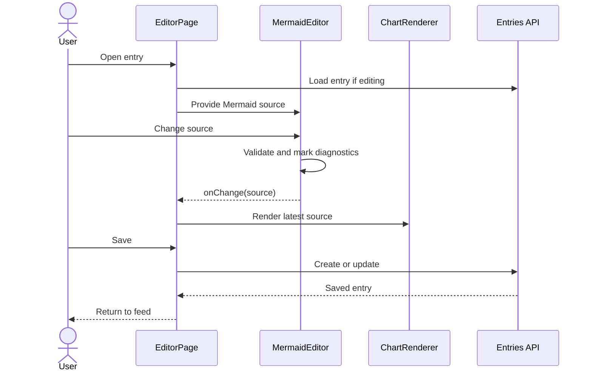
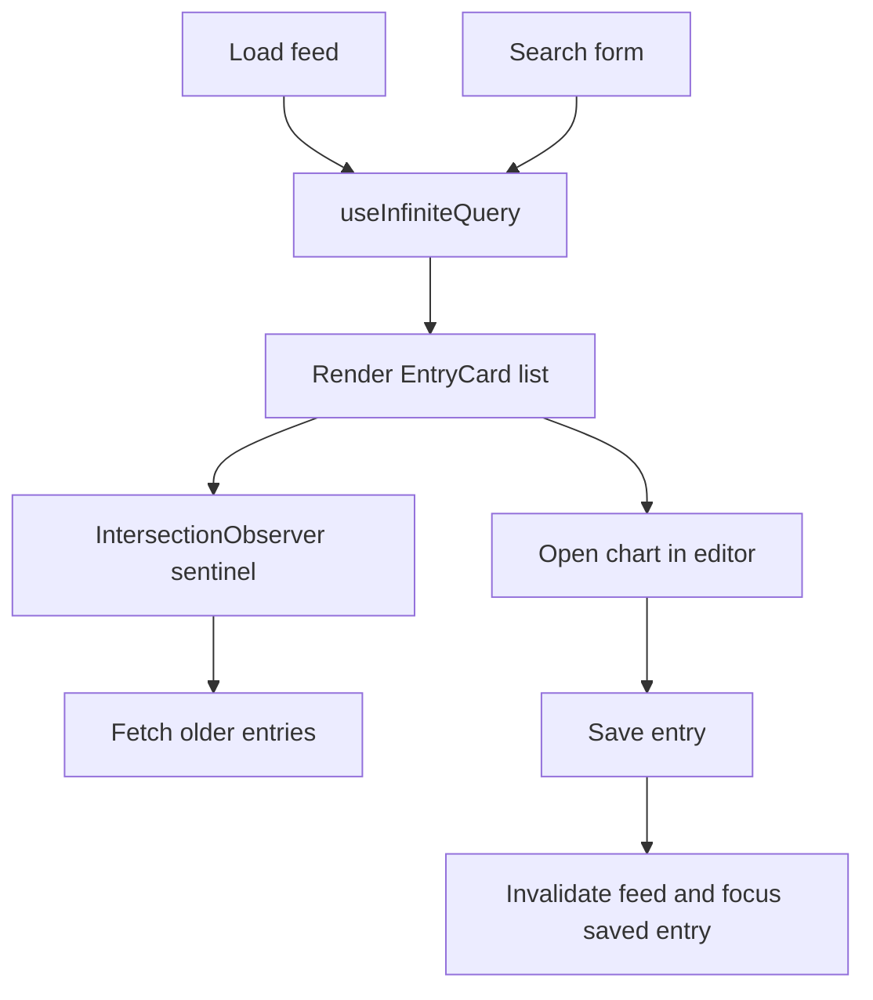
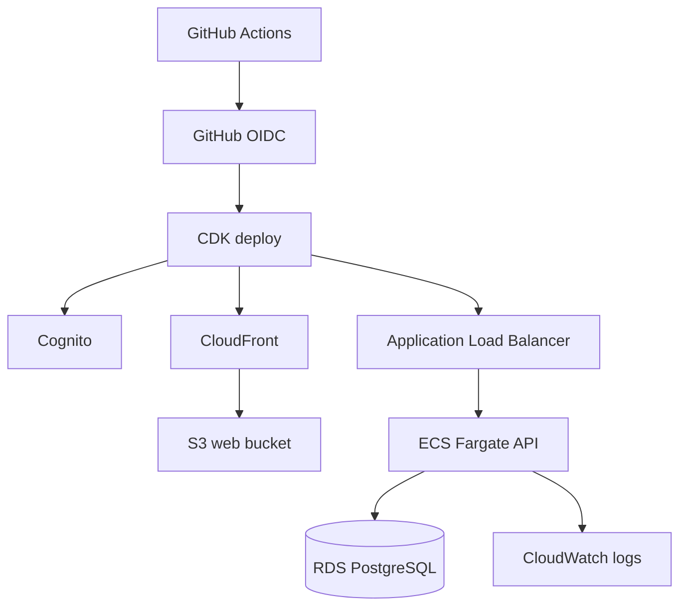
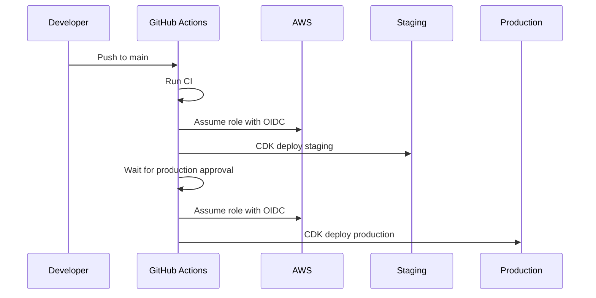
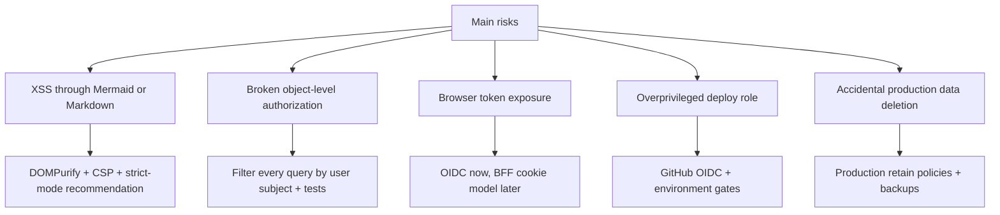

# Step-by-Step Guide: Build Mermaid Notes

This guide walks through how to recreate this repository from an empty folder. It is written for someone learning the stack, so it explains the order of work, the purpose of each layer, and the key tradeoffs without turning every decision into a deep architecture paper.

The project you are building is a private Mermaid note application:

- A signed-in user creates entries with a Markdown description and Mermaid chart source.
- The home screen shows the user's entries in reverse chronological order.
- Search matches words in either the description or the Mermaid source.
- Clicking a rendered chart opens a split editor with Mermaid source on the left and live preview on the right.
- Saving updates the modified time and moves the entry to the top of the feed.
- The cloud target is AWS with infrastructure as code and GitHub-based deployment.

## 1. Understand The Target Shape

Before writing code, make the target architecture visible. The project is intentionally split into a React SPA, an ASP.NET Core API, PostgreSQL, local Aspire orchestration, and AWS CDK infrastructure.



### Build Order Infographic

| Phase | What You Create | Why It Comes Here |
| --- | --- | --- |
| Foundation | Repo, solution, shared package versions | Keeps later steps consistent |
| API | Minimal API, EF Core, PostgreSQL schema | Gives the UI a real contract |
| Local platform | Aspire AppHost | Makes the database/API/web loop repeatable |
| Frontend | React feed, editor, Mermaid renderer | Implements the visible workflow |
| Tests | API integration, frontend, Playwright, CDK | Protects ownership, search, and editing behavior |
| Cloud | CDK stack and GitHub Actions | Turns the app into a deployable reference |
| Documentation | Architecture, ADRs, runbook, readiness notes | Makes the project understandable to others |

## 2. Choose The Main Architecture

Use a React SPA and ASP.NET Core API as two separate deployable surfaces.

Why this direction:

- React, Vite, Monaco, Mermaid, TanStack Query, and Fluent UI give a strong browser editing experience.
- ASP.NET Core Minimal APIs keep the backend direct and easy to review.
- A modular monolith gives clean module boundaries without introducing service-to-service complexity too early.
- PostgreSQL is enough for entries, ownership filters, cursor paging, and search.
- AWS CDK keeps cloud infrastructure reviewable in the same repo.

Other reasonable options:

- Blazor could keep more code in .NET, but Monaco and Mermaid authoring are stronger in the React ecosystem.
- A backend-for-frontend could hide browser tokens in cookies, but it adds more moving parts for the first version.
- DynamoDB could work for simple per-user entries, but PostgreSQL gives richer search and relational migration tooling.
- OpenSearch could improve advanced relevance later, but PostgreSQL full-text search is a better first step.

## 3. Create The Repository Layout

From an empty folder:

```bash
mkdir MermaidNotes
cd MermaidNotes
git init
mkdir -p src/api src/web src/apphost tests/api infra/cdk docs/adr docs/diagrams .github/workflows
```

Create the target layout:

```text
src/api       ASP.NET Core .NET 10 API
src/web       React/TypeScript SPA
src/apphost   .NET Aspire local orchestration
tests/api     API unit and integration tests
infra/cdk     AWS CDK TypeScript app
docs          Architecture, ADRs, threat model, runbooks
```

Why this direction:

- `src` keeps runtime code together.
- `tests` separates verification from production code.
- `infra` makes cloud deployment part of the same product.
- `docs` captures decisions that would otherwise stay in chat or memory.

## 4. Pin The Toolchain

Create `global.json`:

```json
{
  "sdk": {
    "version": "10.0.100",
    "rollForward": "latestFeature"
  }
}
```

Create `Directory.Build.props`:

```xml
<Project>
  <PropertyGroup>
    <TargetFramework>net10.0</TargetFramework>
    <Nullable>enable</Nullable>
    <ImplicitUsings>enable</ImplicitUsings>
    <TreatWarningsAsErrors>true</TreatWarningsAsErrors>
    <AnalysisMode>Recommended</AnalysisMode>
    <InvariantGlobalization>false</InvariantGlobalization>
  </PropertyGroup>
</Project>
```

Create `Directory.Packages.props` and turn on central package management:

```xml
<Project>
  <PropertyGroup>
    <ManagePackageVersionsCentrally>true</ManagePackageVersionsCentrally>
  </PropertyGroup>

  <ItemGroup>
    <PackageVersion Include="Microsoft.AspNetCore.Authentication.JwtBearer" Version="10.0.8" />
    <PackageVersion Include="Microsoft.EntityFrameworkCore" Version="10.0.8" />
    <PackageVersion Include="Npgsql.EntityFrameworkCore.PostgreSQL" Version="10.0.2" />
    <PackageVersion Include="Testcontainers.PostgreSql" Version="4.12.0" />
    <PackageVersion Include="xunit" Version="2.9.3" />
  </ItemGroup>
</Project>
```

The real repository includes additional Aspire, OpenTelemetry, testing, and EF packages. Add those as the project needs them.

Why this direction:

- `global.json` makes SDK selection explicit.
- Central package management avoids version drift across projects.
- `TreatWarningsAsErrors` raises the quality bar early.

## 5. Create The .NET Projects

Create the API project:

```bash
dotnet new web -n MermaidNotes.Api -o src/api
```

Create the test project:

```bash
dotnet new xunit -n MermaidNotes.Api.Tests -o tests/api
```

Create the Aspire AppHost:

```bash
dotnet new aspire-apphost -n MermaidNotes.AppHost -o src/apphost
```

Create the solution file. This repository uses `MermaidNotes.slnx`, the newer solution format. If your .NET 10 SDK exposes `slnx` creation directly, use that and add projects to `MermaidNotes.slnx`:

```bash
dotnet new sln --name MermaidNotes --format slnx
dotnet sln MermaidNotes.slnx add src/api/MermaidNotes.Api.csproj
dotnet sln MermaidNotes.slnx add tests/api/MermaidNotes.Api.Tests.csproj
dotnet sln MermaidNotes.slnx add src/apphost/MermaidNotes.AppHost.csproj
```

If your SDK only supports the older solution format, create `MermaidNotes.sln` with `dotnet new sln --name MermaidNotes`, add the same projects to it, and convert to `.slnx` later when your tooling supports it.

## 6. Add Backend Packages

In `src/api/MermaidNotes.Api.csproj`, reference the API packages:

```xml
<ItemGroup>
  <PackageReference Include="Microsoft.AspNetCore.Authentication.JwtBearer" />
  <PackageReference Include="Microsoft.EntityFrameworkCore" />
  <PackageReference Include="Microsoft.EntityFrameworkCore.Design" />
  <PackageReference Include="Microsoft.Extensions.Diagnostics.HealthChecks.EntityFrameworkCore" />
  <PackageReference Include="Npgsql.EntityFrameworkCore.PostgreSQL" />
  <PackageReference Include="OpenTelemetry.Exporter.Console" />
  <PackageReference Include="OpenTelemetry.Exporter.OpenTelemetryProtocol" />
  <PackageReference Include="OpenTelemetry.Extensions.Hosting" />
  <PackageReference Include="OpenTelemetry.Instrumentation.AspNetCore" />
  <PackageReference Include="OpenTelemetry.Instrumentation.Http" />
  <PackageReference Include="OpenTelemetry.Instrumentation.Runtime" />
</ItemGroup>
```

In `tests/api/MermaidNotes.Api.Tests.csproj`, reference test packages:

```xml
<ItemGroup>
  <PackageReference Include="Microsoft.AspNetCore.Mvc.Testing" />
  <PackageReference Include="Microsoft.NET.Test.Sdk" />
  <PackageReference Include="Shouldly" />
  <PackageReference Include="Testcontainers.PostgreSql" />
  <PackageReference Include="xunit" />
  <PackageReference Include="xunit.runner.visualstudio" />
</ItemGroup>
```

Why this direction:

- EF Core and Npgsql give typed data access plus migrations.
- Testcontainers gives integration tests against real PostgreSQL.
- OpenTelemetry makes the service observable from the beginning.

## 7. Model The Entry Domain

Create the `Entries` module folder:

```bash
mkdir -p src/api/Modules/Entries src/api/Database
```

Create these files:

```text
src/api/Modules/Entries/Entry.cs
src/api/Modules/Entries/EntryContracts.cs
src/api/Modules/Entries/EntryValidation.cs
src/api/Modules/Entries/CurrentUser.cs
src/api/Modules/Entries/EntryCursor.cs
src/api/Modules/Entries/EntriesModule.cs
src/api/Database/EntriesDbContext.cs
```

The core entity needs these fields:

| Field | Purpose |
| --- | --- |
| `Id` | Stable entry identifier |
| `UserId` | Cognito `sub` or local test user id |
| `DescriptionMarkdown` | Human note summary |
| `MermaidSource` | Mermaid chart definition |
| `CreatedAt` | Original create time |
| `ModifiedAt` | Sort key for the feed |



Important design rule:

Every read, update, delete, list, and search operation must filter by `UserId`. Returning `404 Not Found` for another user's entry is acceptable because it avoids revealing whether the entry exists.

## 8. Add EF Core And PostgreSQL Search

In `EntriesDbContext`, use a dedicated schema:

- Schema name: `entries`
- Table name: `note_entries`
- Index: `(user_id, modified_at DESC)` for the feed
- Index: `user_id` for ownership filtering

Also create `src/api/Database/schema.sql` so learners can understand what EF is building:

```sql
CREATE SCHEMA IF NOT EXISTS entries;
CREATE EXTENSION IF NOT EXISTS pg_trgm;

CREATE TABLE IF NOT EXISTS entries.note_entries (
  id uuid PRIMARY KEY,
  user_id varchar(256) NOT NULL,
  description_markdown varchar(8000) NOT NULL,
  mermaid_source varchar(40000) NOT NULL,
  created_at timestamptz NOT NULL,
  modified_at timestamptz NOT NULL
);
```

Add search indexes:

```sql
CREATE INDEX IF NOT EXISTS ix_note_entries_full_text
  ON entries.note_entries
  USING GIN (to_tsvector('english', coalesce(description_markdown, '') || ' ' || coalesce(mermaid_source, '')));

CREATE INDEX IF NOT EXISTS ix_note_entries_description_trgm
  ON entries.note_entries
  USING GIN (description_markdown gin_trgm_ops);

CREATE INDEX IF NOT EXISTS ix_note_entries_mermaid_trgm
  ON entries.note_entries
  USING GIN (mermaid_source gin_trgm_ops);
```

Why this direction:

- Full-text search handles normal word search.
- Trigram search helps when users search partial Mermaid identifiers like `PaymentGateway`.
- PostgreSQL keeps search inside the same transactional data store.

Other options:

- Use only `ILIKE` for a small prototype.
- Add OpenSearch if ranking, facets, or cross-document search become product-critical.
- Add a generated `tsvector` column if search traffic grows.

## 9. Build The Minimal API

In `src/api/Program.cs`, register the core services:

- Problem details
- Health checks
- `EntriesDbContext`
- CORS for the Vite origin
- Rate limiting
- Authentication and authorization
- OpenTelemetry tracing and metrics

The route shape is:

```text
GET    /health/live
GET    /health/ready
GET    /api/v1/entries
GET    /api/v1/entries/search?q=...
POST   /api/v1/entries
GET    /api/v1/entries/{id}
PUT    /api/v1/entries/{id}
DELETE /api/v1/entries/{id}
```

Endpoint behavior:

| Endpoint | Behavior |
| --- | --- |
| `GET /entries` | Return current user's entries by `ModifiedAt DESC`, with cursor paging |
| `GET /entries/search` | Search current user's description and Mermaid source |
| `POST /entries` | Validate, trim, set created/modified timestamps |
| `GET /entries/{id}` | Fetch only if the entry belongs to the current user |
| `PUT /entries/{id}` | Validate, update content, refresh `ModifiedAt` |
| `DELETE /entries/{id}` | Delete only if the entry belongs to the current user |

Use `TypedResults` return types. They make endpoint intent explicit and help tests catch response-shape drift.

## 10. Add Authentication Modes

The API supports two modes:

| Mode | Use Case | How It Works |
| --- | --- | --- |
| `Test` | Local development and integration tests | A custom handler reads `X-Test-User-Id` |
| `Cognito` | Cloud and real auth | JWT bearer validation against Amazon Cognito |

Create `ICurrentUser` and `HttpContextCurrentUser` so endpoint code can ask for the current subject without knowing the auth implementation.

Why this direction:

- Test auth keeps local development fast.
- Cognito is a managed OIDC provider with Hosted UI support.
- Using the subject claim as `UserId` gives a stable ownership key.

Other options:

- Auth0 or Entra ID could replace Cognito.
- A BFF could store tokens in HTTP-only cookies instead of browser-accessible tokens.
- ASP.NET Core Identity could work for a fully self-hosted identity model.

## 11. Implement Cursor Paging

The feed is reverse chronological, so use `ModifiedAt` as the first cursor key.

Current simple logic:

```text
first page:
  ORDER BY modified_at DESC
  TAKE limit + 1

next page:
  WHERE modified_at < decoded_cursor.modified_at
  ORDER BY modified_at DESC
  TAKE limit + 1
```

Encode the cursor as base64 JSON or base64 timestamp. This repository uses a base64 timestamp payload.

Why this direction:

- Cursor paging is more stable than page numbers when new entries are inserted.
- The UI can load older entries without recalculating page offsets.

Future improvement:

- Include both `ModifiedAt` and `Id` in the cursor to break ties deterministically.

## 12. Create The First Migration

Install EF tooling if needed:

```bash
dotnet tool install --global dotnet-ef
```

Create the migration:

```bash
dotnet ef migrations add InitialCreate --project src/api
```

Apply locally:

```bash
dotnet ef database update --project src/api
```

In this repository, AppHost and tests set `Database:MigrateOnStartup=true`, so the database can migrate automatically in local and test environments.

## 13. Add Local Orchestration With Aspire

In `src/apphost/Program.cs`, create:

- A PostgreSQL resource with a persistent data volume.
- A `mermaidnotes` database.
- The API project, waiting for PostgreSQL.
- The Vite web app, waiting for the API.



Key environment variables:

| Variable | Value |
| --- | --- |
| `Authentication__Mode` | `Test` for local default |
| `Database__MigrateOnStartup` | `true` |
| `Cors__AllowedOrigins__0` | `http://localhost:5173` |
| `VITE_API_BASE_URL` | API endpoint emitted by Aspire |
| `VITE_AUTH_MODE` | `mock` for local default |

Run it:

```bash
dotnet restore MermaidNotes.slnx
dotnet run --project src/apphost/MermaidNotes.AppHost.csproj
```

Why this direction:

- New developers get a running database, API, and web app with one command.
- Local auth stays frictionless.
- The AppHost documents runtime dependencies in executable form.

## 14. Create The React App

Create the Vite project:

```bash
npm create vite@latest src/web -- --template react-ts
cd src/web
npm install
```

Install application dependencies:

```bash
npm install @fluentui/react-components @fluentui/react-icons
npm install @tanstack/react-query
npm install @monaco-editor/react monaco-editor
npm install mermaid dompurify marked date-fns
npm install react-oidc-context oidc-client-ts
npm install react-resizable-panels
```

Install test dependencies:

```bash
npm install -D vitest @testing-library/react @testing-library/jest-dom jsdom
npm install -D @playwright/test
```

Why this direction:

- Vite keeps the frontend build fast.
- Fluent UI provides a professional component baseline.
- TanStack Query handles loading, caching, invalidation, and infinite queries.
- Monaco gives the editor room to grow.
- Mermaid and DOMPurify implement preview plus sanitization.

## 15. Add Frontend Configuration

Create `src/web/src/lib/config.ts`:

| Setting | Purpose |
| --- | --- |
| `VITE_API_BASE_URL` | API root |
| `VITE_AUTH_MODE` | `mock` or `oidc` |
| `VITE_COGNITO_AUTHORITY` | Cognito Hosted UI authority used by the SPA |
| `VITE_COGNITO_CLIENT_ID` | Public SPA app client |
| `VITE_COGNITO_REDIRECT_URI` | Login callback |
| `VITE_COGNITO_POST_LOGOUT_REDIRECT_URI` | Logout callback |

Create `src/web/.env.example` with those variables so local setup is discoverable.

## 16. Build The Auth Provider

Create `src/web/src/lib/auth.tsx`.

The provider should expose one simple app-facing shape:

```ts
type AuthSession = {
  isLoading: boolean;
  isAuthenticated: boolean;
  userName: string;
  accessToken?: string;
  signIn: () => Promise<void>;
  signOut: () => Promise<void>;
};
```

Implementation:

- If `VITE_AUTH_MODE=mock`, return a local always-authenticated session.
- If OIDC is configured, wrap the app with `react-oidc-context`.
- Expose the access token to the API client.

Why this direction:

- UI components should not know whether auth is mock or Cognito.
- Local development can start before Cognito exists.
- Production can switch to OIDC through environment variables.

## 17. Build The API Client

Create `src/web/src/lib/apiClient.ts` and `src/web/src/features/entries/entriesApi.ts`.

The API client should:

- Prefix paths with `VITE_API_BASE_URL`.
- Send JSON bodies.
- Attach `Authorization: Bearer <token>` when a token exists.
- Attach `X-Test-User-Id` during mock mode.
- Throw a typed `ApiError` when responses are not successful.

The entries API should expose:

```ts
listEntries(token, cursor)
searchEntries(token, q)
getEntry(token, id)
createEntry(token, input)
updateEntry(token, id, input)
deleteEntry(token, id)
```

## 18. Build The Mermaid Renderer

Create `src/web/src/components/ChartRenderer.tsx`.

Rendering flow:



Important implementation details:

- Call `mermaid.initialize` with `startOnLoad: false`.
- Use deterministic IDs for stable rendering.
- Use `securityLevel: "loose"` because this project allows richer Mermaid features.
- Sanitize SVG output with DOMPurify before inserting it into the DOM.
- Show a loading state while rendering and an error message when parse/render fails.

Security note:

Loose Mermaid rendering is a reviewed exception for this reference app. For shared corporate use, prefer strict mode or render in a sandboxed iframe unless a specific feature requires loose mode.

## 19. Build Monaco Mermaid Support

Create `src/web/src/lib/mermaidSupport.ts`.

Add these editor capabilities:

| Capability | Implementation |
| --- | --- |
| Mermaid language id | `monaco.languages.register` |
| Syntax coloring | Monarch tokenizer for Mermaid keywords, comments, strings, arrows |
| Snippets | Completion provider for flowchart, sequence, state, class, ER templates |
| Validation | Debounced `mermaid.parse` |
| Formatting | Trim trailing whitespace and normalize blank lines |
| Quick fixes | Deterministic cleanup for common mixed Mermaid syntax |

Why this direction:

- Monaco does not ship Mermaid support out of the box.
- A small language registration gives immediate value without building a full language server.
- Deterministic quick fixes are safer than AI-based code mutation inside the editor.

Other options:

- Use CodeMirror if you want a lighter editor.
- Build a Mermaid language server later if diagnostics and autocomplete need to become much deeper.
- Add schema-aware diagram snippets as the product learns common diagram types.

## 20. Build The Split Editor Page

Create `src/web/src/features/entries/MermaidEditor.tsx`.

It should:

- Mount Monaco.
- Register Mermaid language support once.
- Add a "Format Mermaid source" action.
- Show validation diagnostics through Monaco markers and a message bar.
- Expose `value` and `onChange` props.

Create `src/web/src/features/entries/EditorPage.tsx`.

It should:

- Load an existing entry when editing.
- Use a default Mermaid template for a new entry.
- Provide a Markdown description textarea.
- Use `react-resizable-panels` for left source and right preview.
- Save through TanStack Query mutation.
- Invalidate `entries` and `entry` queries after save.
- Call `onSaved(entry)` so the app returns to the feed and focuses the saved entry.



## 21. Build The Feed Page

Create `src/web/src/features/entries/EntryCard.tsx`.

Each card should show:

- Last modified time using `date-fns`.
- Sanitized Markdown description.
- Rendered chart.
- Delete action.
- A chart button that opens the editor.

Create `src/web/src/features/entries/FeedPage.tsx`.

It should:

- Use `useInfiniteQuery` for reverse chronological entries.
- Use the submitted search text as part of the query key.
- Use an `IntersectionObserver` sentinel to load older entries.
- Disable infinite scroll while search is active.
- Confirm before delete.
- Scroll the saved/edited entry into view when returning from the editor.



Why this direction:

- Infinite scroll matches the social-feed style behavior.
- Search uses the same card display as the normal feed.
- Saved entries naturally move to the top because the backend updates `ModifiedAt`.

## 22. Wire The App Shell

Create `src/web/src/App.tsx`.

Keep the first version simple:

- If auth is loading, show a spinner.
- If not authenticated, show a login screen.
- If authenticated, show top nav and either feed or editor.
- Store active screen in local React state.

This repository does not need a router yet because there are only two screens. A router is a good next step if you add deep links, browser history, shared URLs, or separate settings/admin pages.

## 23. Add Styling

Create `src/web/src/styles.css`.

Style goals:

- Make the feed easy to scan.
- Keep cards compact and readable.
- Make the editor fill the viewport.
- Keep the chart preview centered and scalable.
- Make resize handles visible but unobtrusive.
- Preserve mobile usability by stacking or constraining panels as needed.

Frontend quality checklist:

| Area | Check |
| --- | --- |
| Feed | Cards do not jump when charts render |
| Search | Results and empty states are clear |
| Editor | Source and preview remain usable after resize |
| Preview | SVG is centered and fits its pane |
| Error state | Mermaid parse errors are readable |
| Mobile | Text does not overflow buttons or cards |

## 24. Add Backend Tests

Use `WebApplicationFactory` and Testcontainers PostgreSQL.

Create `tests/api/EntriesApiFactory.cs`:

- Start a `postgres:17-alpine` container.
- Set `Authentication:Mode=Test`.
- Set `Database:MigrateOnStartup=true`.
- Point the API at the container connection string.

Create tests for:

| Test | Why It Matters |
| --- | --- |
| Entries are scoped by user | Prevents broken object-level authorization |
| Entries sort by modified time | Protects feed behavior |
| Updating moves entry to top | Protects the save-and-return workflow |
| Search finds description and source | Protects the core search promise |
| Delete removes only owned entry | Protects ownership and delete behavior |
| Cursor codec round trips | Protects infinite scroll paging |

Run:

```bash
dotnet test tests/api/MermaidNotes.Api.Tests.csproj
```

## 25. Add Frontend Tests

Use Vitest for fast unit/component tests.

Suggested tests:

- Markdown sanitization.
- Mermaid formatting and quick fix helpers.
- Entries API URL construction.
- Feed loading, empty, search, and error states.
- Editor save/cancel behavior.

Run:

```bash
cd src/web
npm test
```

Use Playwright for browser-level smoke tests:

```bash
cd src/web
npm run test:e2e
```

The current E2E smoke test verifies that the local-auth feed opens and that the user can open the new-entry editor.

## 26. Add API Container Support

Create `src/api/Dockerfile`.

The container should:

- Build and publish the API from the repo root.
- Run as a production ASP.NET Core app.
- Listen on port `8080`.
- Keep build output separate from runtime output.

Why this direction:

- ECS Fargate deploys containers.
- Building from the repo root lets the Dockerfile restore solution-level props and package settings.
- The CDK stack can build the image as an asset.

## 27. Create The AWS CDK App

Inside `infra/cdk`:

```bash
npm init -y
npm install aws-cdk-lib constructs
npm install -D aws-cdk typescript tsx vitest @types/node
```

Create:

```text
infra/cdk/bin/app.ts
infra/cdk/lib/mermaid-notes-stack.ts
infra/cdk/test/mermaid-notes-stack.test.ts
infra/cdk/cdk.json
infra/cdk/tsconfig.json
```

The stack should create:

| Resource | Purpose |
| --- | --- |
| VPC | Network boundary for ECS and RDS |
| S3 bucket | Hosts built SPA assets |
| CloudFront distribution | HTTPS CDN entrypoint for SPA |
| Cognito user pool | Managed sign-up/sign-in |
| Cognito app client | Authorization Code + PKCE for SPA |
| RDS PostgreSQL | Durable entry storage |
| ECS cluster | API runtime |
| Application Load Balanced Fargate service | Public API endpoint and health checks |
| CloudWatch log group | API logs |
| GitHub OIDC provider and role | Deployment without long-lived AWS keys |



Staging versus production defaults:

| Setting | Staging | Production |
| --- | --- | --- |
| NAT gateways | 1 | 2 |
| API desired count | 1 | 2 |
| RDS Multi-AZ | false | true |
| Stateful removal policy | destroyable | retained |
| Log retention | shorter | longer |

## 28. Add CDK Tests

Use Vitest plus CDK assertions.

Test for important resources:

- Cognito user pool.
- S3 bucket and CloudFront distribution.
- RDS instance.
- ECS/Fargate service.
- GitHub OIDC role.

Run:

```bash
cd infra/cdk
npm test
npm run synth -- --context githubOwner=replace-me --context githubRepo=replace-me
```

Why this direction:

- CDK tests catch accidental removal of required infrastructure.
- `cdk synth` validates that the stack can become CloudFormation.

## 29. Add CI And Deployment Workflows

Create `.github/workflows/ci.yml`.

Jobs:

| Job | Steps |
| --- | --- |
| Backend | Restore, build, test .NET |
| Web | `npm ci`, unit tests, build |
| Infrastructure | `npm ci`, TypeScript build, CDK tests, synth |

Create `.github/workflows/deploy.yml`.

Deployment behavior:

- Trigger on pushes to `main`.
- Require `vars.ENABLE_AWS_DEPLOY == 'true'`.
- Use GitHub OIDC to assume the AWS deploy role.
- Build the web app with OIDC environment variables.
- Deploy CDK to staging.
- Deploy production only after the production GitHub Environment approval.



Why this direction:

- OIDC avoids long-lived AWS access keys in GitHub.
- Environment approvals give production a human gate.
- Keeping deploy disabled by default prevents accidental AWS spending.

## 30. Add Documentation

Create these docs:

```text
docs/architecture.md
docs/threat-model.md
docs/runbook.md
docs/cost-and-scaling.md
docs/operational-readiness.md
docs/adr/0001-react-spa-plus-dotnet-api.md
docs/adr/0002-cognito-oidc.md
docs/adr/0003-modular-monolith-postgresql.md
docs/adr/0004-mermaid-loose-rendering.md
docs/adr/0005-aws-ecs-cdk.md
```

Documentation purpose:

| Document | Purpose |
| --- | --- |
| Architecture | Explains the runtime shape and module boundaries |
| Threat model | Names assets, risks, and controls |
| Runbook | Gives local run, deploy, rollback, and incident steps |
| Cost and scaling | Explains what costs money and how to scale |
| Operational readiness | Lists production acceptance checks |
| ADRs | Captures why major choices were made |

Keep ADRs short. They should explain context, decision, rationale, and consequences.

## 31. Create The README

The README should be the quick entrypoint:

- What the app does.
- Main technology stack.
- Architecture diagram.
- User workflow diagram.
- Repository layout.
- Local development commands.
- Backend, frontend, and infrastructure commands.
- Security note for Mermaid loose rendering.

Keep the README public-facing. Put deeper teaching material in this `step-by-step.md` guide.

## 32. Run The Full Local Verification

From the repo root:

```bash
dotnet restore MermaidNotes.slnx
dotnet build MermaidNotes.slnx
dotnet test tests/api/MermaidNotes.Api.Tests.csproj
```

From `src/web`:

```bash
npm ci
npm test
npm run build
```

From `infra/cdk`:

```bash
npm ci
npm run build
npm test
npm run synth -- --context githubOwner=replace-me --context githubRepo=replace-me
```

Then run locally:

```bash
dotnet run --project src/apphost/MermaidNotes.AppHost.csproj
```

Manual smoke checklist:

- Feed loads with mock auth.
- New entry opens the split editor.
- Mermaid preview updates when source changes.
- Save returns to feed.
- Saved entry appears at the top.
- Search finds text from description and Mermaid source.
- Delete removes an entry.

## 33. Deploy Staging For The First Time

Prerequisites:

- AWS CLI is authenticated.
- CDK is bootstrapped in the target account and region.
- Docker is available for the API image asset build.
- The web app has been built if you want the CDK deployment to include frontend assets.

Bootstrap:

```bash
cd infra/cdk
npx cdk bootstrap
```

Deploy staging:

```bash
npx cdk deploy MermaidNotes-staging \
  --context stage=staging \
  --context githubOwner=<github-owner> \
  --context githubRepo=<repo-name>
```

Capture outputs:

| Output | Where It Goes |
| --- | --- |
| `GitHubDeployRoleArn` | GitHub Environment secret `AWS_DEPLOY_ROLE_ARN` |
| `ApiUrl` | GitHub Environment variable `VITE_API_BASE_URL` |
| `CognitoAuthority` | GitHub Environment variable `VITE_COGNITO_AUTHORITY` |
| `CognitoClientId` | GitHub Environment variable `VITE_COGNITO_CLIENT_ID` |
| `WebUrl` | Callback/logout URL review |

After both staging and production environments are configured, set repository variable:

```text
ENABLE_AWS_DEPLOY=true
```

## 34. Know The Main Risks



Security decisions to remember:

- Client-side rendering does not make XSS impossible. Sanitize rendered SVG and Markdown.
- Per-user filtering belongs in every endpoint and search query.
- Test auth is for local/test only.
- Production data should be retained by default.
- Deployment roles should be reviewed before shared use.

## 35. Extension Ideas After Recreating The Repo

Once the baseline works, useful next improvements are:

| Improvement | Why It Matters |
| --- | --- |
| Router with deep links | Shareable editor URLs and browser history |
| Entry tags or folders | Better organization as data grows |
| Autosave drafts | Safer editing experience |
| Version history | Restore previous Mermaid definitions |
| Sandboxed Mermaid iframe | Stronger isolation for loose rendering |
| BFF auth model | Keeps tokens out of browser JavaScript |
| Audit log | Corporate traceability for create/update/delete |
| WAF and alarms | Better production protection and response |
| ECS autoscaling | Handles traffic growth |
| Read replicas or OpenSearch | Scaling path for heavier search traffic |

## Final Replication Checklist

Use this list to confirm you recreated the project:

- [ ] Repo has `src/api`, `src/web`, `src/apphost`, `tests/api`, `infra/cdk`, `docs`, and `.github/workflows`.
- [ ] API targets `net10.0`.
- [ ] API has versioned `/api/v1/entries` endpoints.
- [ ] API filters every entry operation by current user.
- [ ] PostgreSQL schema includes `entries.note_entries`.
- [ ] Search checks description and Mermaid source.
- [ ] Feed sorts by `ModifiedAt DESC`.
- [ ] Updating an entry refreshes `ModifiedAt`.
- [ ] React app has mock auth and OIDC auth modes.
- [ ] Feed supports infinite scroll and search.
- [ ] Entry card renders Markdown description and Mermaid chart.
- [ ] Editor has source panel, live preview panel, save, and cancel.
- [ ] Monaco has Mermaid tokens, snippets, diagnostics, format, and quick fixes.
- [ ] Mermaid output is sanitized before DOM insertion.
- [ ] Aspire starts PostgreSQL, API, and web app locally.
- [ ] API tests use Testcontainers PostgreSQL.
- [ ] Frontend tests and Playwright smoke tests exist.
- [ ] CDK stack provisions Cognito, S3/CloudFront, ECS Fargate, RDS, CloudWatch, and GitHub OIDC.
- [ ] CI builds and tests backend, frontend, and infrastructure.
- [ ] Deployment workflow uses GitHub Environments and production approval.
- [ ] Docs include architecture, ADRs, threat model, runbook, cost/scaling, and readiness checklist.

If every item is true, you have rebuilt the same application shape represented by this repository.
